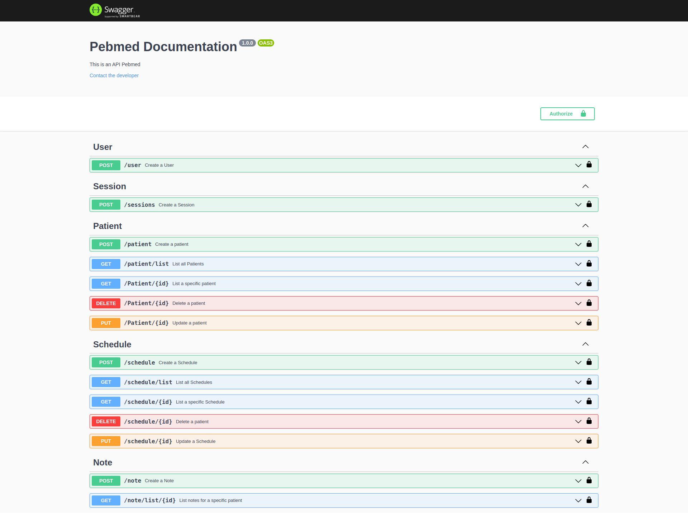
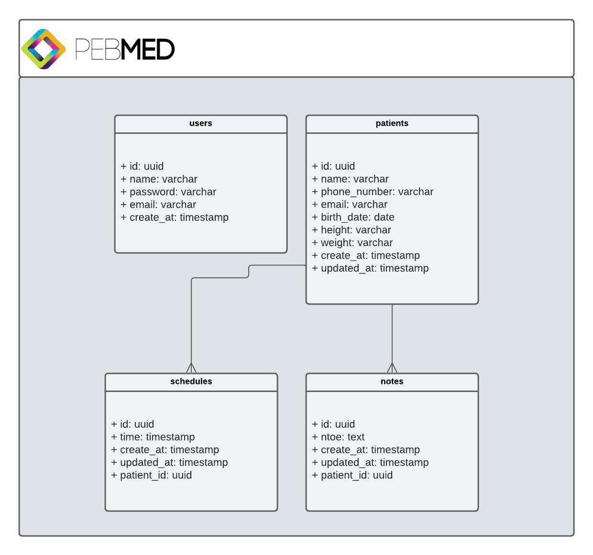

# PEBMED-CHALLENGE-API

API criada para o desafio da PEBMED.

- NodeJS
- MySQL
- Express
- TypeORM
- UUID
- JWT
- Bcrypt
- Jest
- ESLint
- Swagger

# Setup

1. Instalar [Docker](https://docs.docker.com/engine/install/)
2. Instalar [Docker-Compose](https://docs.docker.com/compose/install/)
3. Conferir [arquivo de variaveis de ambiente](.env)
4. Rodar o comando `docker-compose up` para subir o ambiente
5. Execute `docker-compose exec app bash` para acessar o container
6. Rodar Migrations com o comando `npm run typeorm migrations:run`
7. O projeto possuir [seed] para gerar o usuário execute `npm run seed:admin`

## Testes

Desenvolvido os testes Unitários, não desenvolvi os testes de aceitação por hora.

Para executar os testes:

1. Execute `docker-compose exec app bash` para acessar o container
2. Rodar os testes `npm run test`

## Documentação da API

Para ver a documentação da api acesse com o projeto up -> [localhost:3000/docs](http://localhost:3000/docs)

# Modelagem do banco de dados

